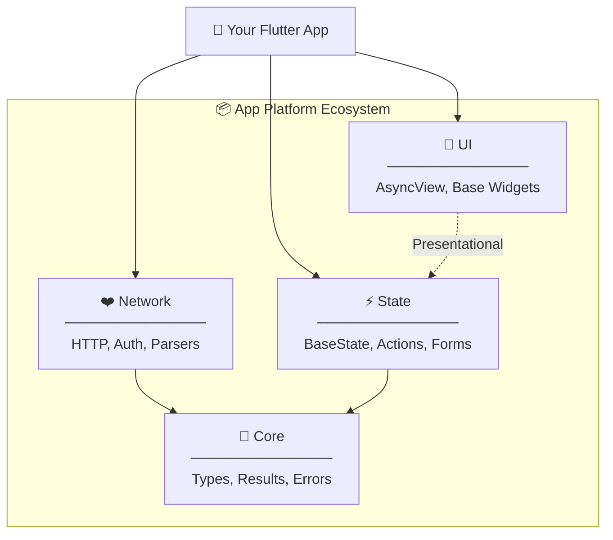
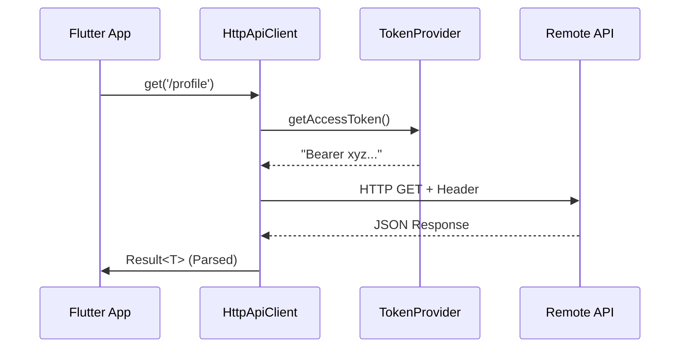

# 📦 App Platform — The Master Guide

> **Deep Dive & Visual Guide**
> Build production-grade Flutter apps with zero boilerplate and maximum scalability.

---

## 🧩 The Mission
App Platform is more than a collection of packages; it is a **design system for logic**. It standardizes how your apps talk to the internet, handle errors, manage screen states, and respond to user actions.

### Why use it?
*   **Consistency**: Every feature in every project follows the same pattern.
*   **Type Safety**: Errors are values (`Result<T>`), not exceptions.
*   **Decoupling**: UI, State, and Networking are strictly separated.
*   **Speed**: Start a new project with infrastructure that's already tested and ready.

---

## 🏗️ Visual Architecture
The platform is organized as a monorepo. Each package has a single, focused responsibility.



---

## 🧠 Deep Dive: `app_platform_core`
The "Brain" of the platform. It defines the language all other packages speak.

### 1. `Result<T>` — Error Handling as a Value
We never "throw" errors in repositories or services. We return them.

```dart
// Define an operation
Future<Result<List<User>>> getUsers() async {
  try {
    final data = await api.fetch();
    return Result.success(data);
  } catch (e) {
    return Result.failure(NetworkError(e.toString()));
  }
}

// Consume it
final result = await getUsers();

result.when(
  success: (users) => renderList(users),
  failure: (error) => showError(error.message),
);
```

### 2. `Paginated<T>` — Infinite Scroll Data Model
Standardized pagination state to keep lists consistent.

| Property | Description |
| :--- | :--- |
| `items` | The accumulated list of data. |
| `hasNext` | Boolean indicating if more data exists on the server. |
| `isLoadingMore` | Prevents duplicate requests during scroll. |

---

## ❤️ Deep Dive: `app_platform_network`
The "Heart" of the platform. Handles the heavy lifting of HTTP communication.

### `HttpApiClient` — The Transport Layer
A wrapper around `http` that handles base URLs, headers, and token injection.



**Implementation Tip:**
Always provide a `parser` function. This keeps your API client agnostic of your models.

```dart
final result = await apiClient.get<User>(
  '/me',
  parser: (json) => User.fromJson(json),
);
```

---

## ⚡ Deep Dive: `app_platform_state`
The "Nervous System". It manages how your app reacts to data and user input.

### 1. `BaseState<T>` — Screen State Management
Every screen usually exists in one of three states: **Loading**, **Success**, or **Error**.

```dart
// In your Notifier
void load() async {
  state = state.toLoading();
  final result = await repo.getData();
  state = result.toBaseState(); // Automatically maps Success/Failure to BaseState
}
```

### 2. `ActionStore` — Tracking Discrete Actions
Don't mix screen loading with button actions (like deleting a user). Use the `ActionStore`.

```mermaid
stateDiagram-v2
    [*] --> Idle
    Idle --> InProgress : action.start(key)
    InProgress --> Success : action.success(key)
    InProgress --> Failure : action.failure(key, error)
    Success --> Idle : clear
    Failure --> Idle : clear
```



### 3. `FormNotifier` — Complex Form Logic
Handles validation (Sync & Async), field tracking, and "Touched" states automatically.

```dart
enum LoginFormFields { email, password }

class LoginNotifier extends FormNotifier<LoginFormFields> {
  LoginNotifier() : super(
    FormStateModel.initial([LoginFormFields.email, LoginFormFields.password]),
    validators: {
      LoginFormFields.email: (val) => val.isEmpty ? 'Required' : null,
    },
  );
}
```

---

## 🎨 Deep Dive: `app_platform_ui`
The "Skin". Reusable widgets that understand the Platform's state models.

### `AsyncView<T>` — The State Switcher
Instead of writing 100 `if` statements for loading/error, use `AsyncView`.

```dart
AsyncView<List<User>>(
  status: state.status,
  data: state.data,
  error: state.error,
  onLoading: () => const ShimmerList(),
  onError: (error) => ErrorWidget(error.message),
  onEmpty: () => const Text("No users found"),
  onSuccess: (users) => ListView(children: users.map(...)),
)
```

---

## 🎓 Master Class: Building a Feature
Let's build a "Product List" with a "Delete" action.

### Step 1: The Repository
```dart
class ProductRepository {
  final HttpApiClient _api;
  
  Future<Result<List<Product>>> fetch() => _api.get('/products', parser: ...);
  Future<Result<void>> delete(int id) => _api.delete('/products/$id');
}
```

### Step 2: The Notifier
```dart
class ProductNotifier extends StateNotifier<BaseState<List<Product>>> with ActionMixin {
  void load() async {
    state = state.toLoading();
    final result = await _repo.fetch();
    state = result.toBaseState();
  }

  void deleteProduct(int id) async {
    final key = 'delete_$id';
    startAction(key);
    
    final result = await _repo.delete(id);
    
    if (result.isSuccess) {
      successAction(key);
      load(); // Refresh list
    } else {
      failureAction(key, result.error!);
    }
  }
}
```

### Step 3: The UI
```dart
Widget build(BuildContext context) {
  return AsyncView(
    status: state.status,
    data: state.data,
    onSuccess: (products) => ListView.builder(
      itemBuilder: (ctx, i) => ListTile(
        title: Text(products[i].name),
        trailing: ActionButton(
          actionKey: 'delete_${products[i].id}',
          onPressed: () => ref.read(provider.notifier).deleteProduct(products[i].id),
          child: Icon(Icons.delete),
        ),
      ),
    ),
  );
}
```

---

## ⚙️ Setup & Maintenance

### 1. Installation
Add the packages to your `pubspec.yaml` via Git. 

> [!IMPORTANT]
> **The Golden Rule**: All packages MUST use the same `ref` (commit hash).

```yaml
dependencies:
  app_platform_core:
    git:
      url: https://github.com/hassanMohammedDEV/app_platform.git
      ref: <hash>
      path: packages/core
  app_platform_state:
    git:
      url: https://github.com/hassanMohammedDEV/app_platform.git
      ref: <hash>
      path: packages/state
```

### 2. Versioning Strategy
When you make changes to `app_platform`:
1.  Commit and push to the `app_platform` repo.
2.  Copy the new commit hash.
3.  Update the `ref` in your consumer apps.
4.  Run `flutter pub get`.

---

> **Summary**: App Platform turns infrastructure into a solved problem. By using `Result` for logic, `BaseState` for screens, `ActionStore` for buttons, and `AsyncView` for UI, you create apps that are robust, testable, and beautiful.
