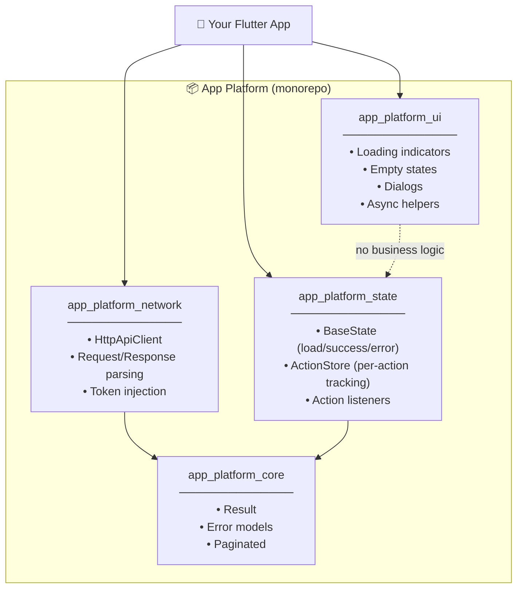
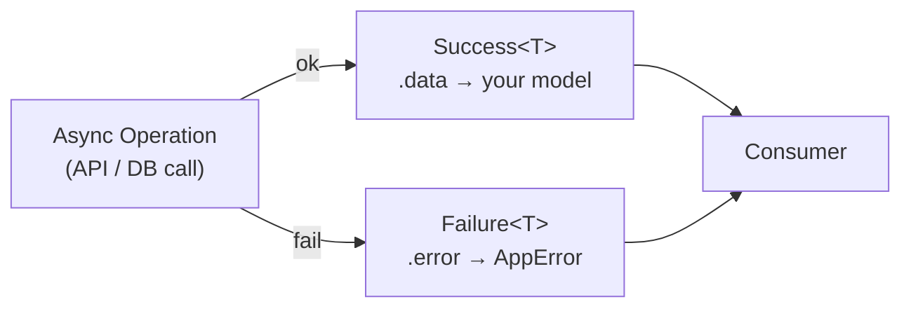
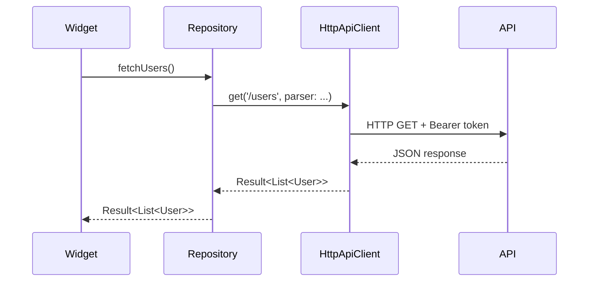
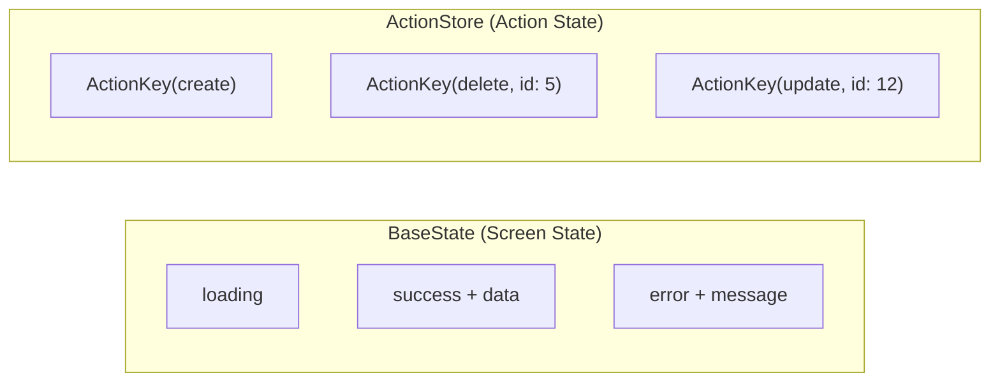
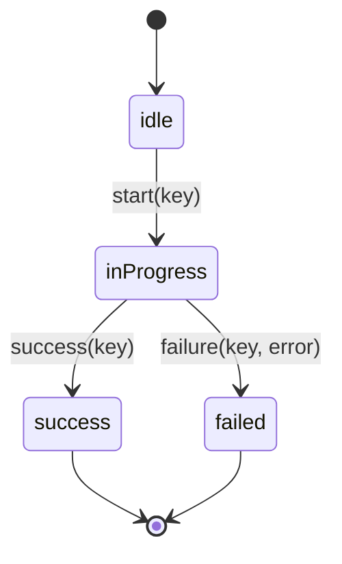
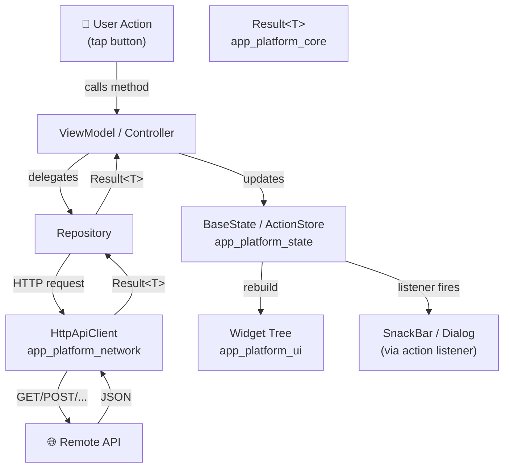

# 📦 App Platform — Deep Dive & Visual Guide

> A reusable Flutter monorepo that provides clean, scalable infrastructure so every new project starts with a strong foundation instead of boilerplate.

---

## 🧩 What Problem Does It Solve?

Every Flutter app needs the same plumbing:

| Problem | Without App Platform | With App Platform |
|---|---|---|
| API calls | Write HTTP logic from scratch per project | `app_platform_network` handles it |
| Loading/error states | Ad-hoc flags everywhere | `app_platform_state` `BaseState` |
| Async result handling | Try/catch spread across codebase | `Result<T>` (Success / Failure) |
| CRUD actions (create, delete…) | Tangled in screen state | `ActionStore` tracks each action independently |
| Pagination | Reinvent every time | `Paginated<T>` model built-in |
| UI feedback (snackbars, dialogs) | Tightly coupled to business logic | Action listeners decouple UI from logic |

---

## 🗂️ Repository Structure

```
app_platform/               ← monorepo root
└── packages/
    ├── core/               ← app_platform_core
    ├── network/            ← app_platform_network
    ├── state/              ← app_platform_state
    └── ui/                 ← app_platform_ui
```

Each package is independent and versioned via a **Git commit hash (`ref`)** — all packages in a consumer project must use the same `ref` for consistency.

---

## 🏗️ Architecture Overview



> **Dependency rule:** `core` is the base. `network` and `state` depend on it. `ui` depends on nothing — it is purely presentational.

---

## 📦 Package-by-Package Breakdown

---

### 1️⃣ `app_platform_core`

**Role:** The shared foundation — types, contracts, and models that all other packages use.

#### `Result<T>` — Explicit Async Handling

Instead of throwing exceptions (which are invisible at the type level), every async operation returns a `Result<T>`:

```dart
final result = await repository.getUsers();

switch (result) {
  case Success(:final data):
    print(data);           // ✅ typed data
  case Failure(:final error):
    print(error.message);  // ❌ structured error, never a raw exception
}
```



#### `Paginated<T>` — Pagination Model

| Property | Purpose |
|---|---|
| `items` | Current list of items |
| `hasNext` | Whether more pages exist |
| `isLoadingMore` | Is next page fetching? |
| `paginationError` | Error from the last page load |

---

### 2️⃣ `app_platform_network`

**Role:** A standardized HTTP layer. Networking logic lives here, completely out of widgets.

#### `HttpApiClient` Setup

```dart
final apiClient = HttpApiClient(
  baseUrl: 'https://dummyjson.com',
  client: http.Client(),
  tokenProvider: AppTokenProvider(),   // injects auth token automatically
);
```

#### Making a Typed API Call

```dart
final result = await apiClient.get<List<User>>(
  '/users',
  parser: (json) =>
      (json['users'] as List).map(User.fromJson).toList(),
);
```



> **Key design:** Parser functions are passed by the caller. `HttpApiClient` handles transport; parsing is explicit per-call. No magic.

---

### 3️⃣ `app_platform_state`

**Role:** State management for screens and discrete user actions — cleanly separated.

It splits state into two concerns:



#### `BaseState` — Screen Loading Cycle

```dart
switch (state.status) {
  case LoadStatus.loading:
    return const CircularProgressIndicator();
  case LoadStatus.success:
    return UsersList(state.data!);
  case LoadStatus.error:
    return Text(state.error!.message);
}
```

#### `ActionStore` — Per-Action Tracking

Each action (delete, update, etc.) has its own lifecycle — no interference with screen data:

```dart
final key = ActionKey(ActionType.delete, id: user.id).value;

state.start(key);    // marks action as in-progress
// ... await API call ...
state.success(key);  // marks action as done
// or
state.failure(key, error); // marks action as failed
```



#### UI Feedback via Action Listeners

SnackBars or dialogs listen to action completion **without tight coupling**:

```
Action completes → listener fires → SnackBar/Dialog/Navigate
```

This keeps business logic clean and UI reactive.

---

### 4️⃣ `app_platform_ui`

**Role:** Pure, reusable UI building blocks. Zero business logic.

| Widget/Helper | Purpose |
|---|---|
| Loading indicator | Consistent spinner across app |
| Empty state widget | "No data" screens |
| Dialogs | Standardized dialogs |
| Async UI helpers | Conditional rendering helpers |

---

## 🔗 How to Add to Your Flutter Project

```yaml
# pubspec.yaml
dependencies:
  app_platform_core:
    git:
      url: https://github.com/hassanMohammedDEV/app_platform.git
      ref: <commit-hash>      # ← same hash for all packages!
      path: packages/core

  app_platform_state:
    git:
      url: https://github.com/hassanMohammedDEV/app_platform.git
      ref: <commit-hash>
      path: packages/state

  app_platform_network:
    git:
      url: https://github.com/hassanMohammedDEV/app_platform.git
      ref: <commit-hash>
      path: packages/network

  app_platform_ui:
    git:
      url: https://github.com/hassanMohammedDEV/app_platform.git
      ref: <commit-hash>
      path: packages/ui
```

Then run:
```bash
flutter pub get
```

> [!IMPORTANT]
> All packages **must use the same `ref`** (commit hash). Mixing versions will cause type incompatibility since `core` types are shared across packages.

---

## 🎯 End-to-End Data Flow



---

## ✅ Design Principles

| Principle | How It's Applied |
|---|---|
| **Separation of concerns** | Each package has exactly one job |
| **Explicit async handling** | `Result<T>` — no hidden exceptions |
| **Predictable error management** | Errors are typed values, not thrown objects |
| **Minimal boilerplate** | One platform setup, reused across all projects |
| **No global event systems** | Clear data flow, no event buses |
| **Long-term maintainability** | Packages are pinned by commit hash |

---

## 🧭 When to Use App Platform

| Use Case | Suitable? |
|---|---|
| Medium–large Flutter apps | ✅ Ideal |
| Apps with multiple CRUD features | ✅ Ideal |
| Paginated lists / infinite scroll | ✅ Ideal |
| Long-term maintained projects | ✅ Ideal |
| Very small prototype / single screen | ⚠️ May be overkill |

---

> **Summary:** App Platform is a well-structured Flutter monorepo that eliminates repeated boilerplate by centralizing networking, state, error handling, pagination, and UI into four focused, composable packages — letting you focus on product features, not infrastructure.
  -----------------------------------------------------------


